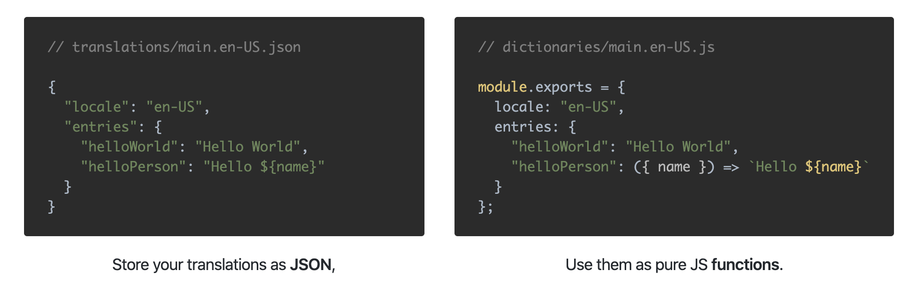

<p align="center">
  
  <br>
  <strong>i18n</strong>, Reimagined!
</p>

<p align="center">
  A blazing fast and super small i18n library for Javascript
</p>

<p align="center">
  <a href="https://www.npmjs.com/package/lisan"></a>
  <a href="https://www.npmjs.com/package/lisan"></a>
  <a href="https://coveralls.io/github/lisanjs/lisan?branch=development"></a>
</p>

<hr>

<p align="center">
<a href="https://lisanjs.com"><strong>Website</strong></a><br><br>
<a href="https://lisanjs.com/docs/what-is-lisan#installation">Installation</a> ·
<a href="https://lisanjs.com/docs/full-api-reference">API</a> ·
<a href="https://lisanjs.com/docs/pluralization">Guides & Tips</a> ·
<a href="https://github.com/lisanjs/examples">Examples</a>
</p>

<hr>

## Introduction

**Lisan** _(Turkish: lee &#183; sun)_ is an i18n library.

It provides all essential tooling to
have **multiple languages** in your applications and
format **numbers**, **currencies**, **ordinals** & **dates** based on locale.

Lisan's biggest difference compared to traditional i18n libraries
is taking advantage of
[ES6 Template Literals](https://developer.mozilla.org/en-US/docs/Web/JavaScript/Reference/Template_literals)
and using them to generate functions to interpolate strings.

<p align="center">
  
</p>

Check out our [website](https://lisanjs.com/docs/what-is-lisan/) to learn more!

## Highlights

- It's blazing [fast](https://lisanjs.com/docs/performance)!
- Framework Agnostic
- Supports [JSX Interpolations](https://lisanjs.com/docs/jsx-interpolation) 🚀**New!**
- Allows you to [lazy load](https://lisanjs.com/docs/lisan-plugin-loader/) your dictionaries.
- [Pluralization](https://lisanjs.com/docs/pluralization/)
- Localization
- Provides a [Compiler](https://lisanjs.com/docs/what-is-lisan-compiler) and a
  [Command Line Tool](https://lisanjs.com/docs/what-is-lisan-cli)
- Can be extended with [plugins](https://lisanjs.com/docs/lisan-plugins/) & [adapters](https://lisanjs.com/docs/lisan-adapters/).

## Example Projects

Here you can find some example projects developed by Lisan to quickly get started.

1. [**Hello World (Node)**](https://github.com/lisanjs/examples/tree/master/01-hello-world-node) - Purpose of this example
   to demonstrate a minimal setup
   to use [LisanJS](https://lisanjs.com).
2. [**Hello World (Browser)**](https://github.com/lisanjs/examples/tree/master/02-hello-world-browser) - Purpose of this example
   to demonstrate a minimal setup
   to use [LisanJS](https://lisanjs.com) that works on browser.
3. [**Hello World (React)**](https://github.com/lisanjs/examples/tree/master/03-hello-world-react) - This example
   shows how to integrate [LisanJS](https://lisanjs.com) into a [ReactJS](https://reactjs.org) application.
4. [**Hello World (Next.js)**](https://github.com/lisanjs/examples/tree/master/04-nextjs-ssr) - Here you can
   learn how to use [LisanJS](https://lisanjs.com) with [NextJS](https://nextjs.org) to achieve server side rendering.
5. [**Hello World (Next.js + Lisan Loader Plugin)**](https://github.com/lisanjs/examples/tree/master/05-ssr-lisan-plugin-loader) - When using next.js,
   you can also use [lisan-plugin-loader](https://lisanjs.co/docs/lisan-plugin-loader) which is also compatible with server side rendering.

More examples are on the way..

## Badge

Show the world you are using _Lisan_.

[](https://github.com/lisanjs/lisan)

```text
[](https://github.com/lisanjs/lisan)
```

## Contributors

Special thanks to [Arif Aydoğmuş](https://github.com/arifaydogmus) for designing our awesome logo! 🙏

## License

Lisan is [MIT licensed](./LICENCE).
