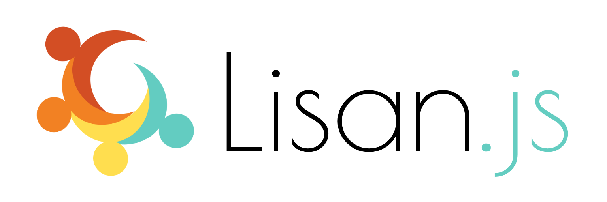

<p align="center">
  
  <br>
  <strong>i18n</strong>, Reimagined!
</p>

<p align="center">
  A blazing fast and super small i18n library for Javascript
</p>

<p align="center">
  <a href="https://www.npmjs.com/package/lisan"></a>
  <a href="https://www.npmjs.com/package/lisan"></a>
  <a href="https://coveralls.io/github/lisanjs/lisan?branch=master"></a>
</p>

<hr>

<p align="center">
<a href="https://lisanjs.com"><strong>Website</strong></a><br><br>
<a href="https://lisanjs.com/docs/what-is-lisan#installation">Installation</a> ·
<a href="https://lisanjs.com/docs/docs/full-api-reference">API</a> ·
<a href="https://lisanjs.com/docs/docs/pluralization">Guides & Tips</a>
</p>

<hr>

## Introduction

**Lisan** _(Turkish: lee &#183; sun)_ is an i18n library.

It provides all essential tooling to
have **multiple languages** in your applications and
format **numbers**, **currencies**, **ordinals** & **dates** based on locale.

Lisan's biggest difference compared to traditional i18n libraries
is taking advantage of
[ES6 Template Literals](https://developer.mozilla.org/en-US/docs/Web/JavaScript/Reference/Template_literals)
and using them to generate functions to interpolate strings.

Click [here](https://lisanjs.com/docs/what-is-lisan/) to learn more!.

## Highlights

- It's blazing [fast](https://lisanjs.com/docs/performance/)!
- Framework Agnostic
- Allows you to [lazy load](https://lisanjs.com/docs/lisan-plugin-loader/) your dictionaries.
- [Pluralization](https://lisanjs.com/docs/pluralization/)
- Localization
- Provides a [Compiler](https://lisanjs.com/docs/what-is-lisan-compiler) and a
  [Command Line Tool](https://lisanjs.com/docs/what-is-lisan-cli)
- Can be extended with [plugins](https://lisanjs.com/docs/lisan-plugins/) & [adapters](https://lisanjs.com/docs/lisan-adapters/).

## Badge

Show the world you are using _Lisan_.

[](https://github.com/lisanjs/lisan)

```text
[](https://github.com/lisanjs/lisan)
```

## License

Lisan is [MIT licensed](./LICENCE).
